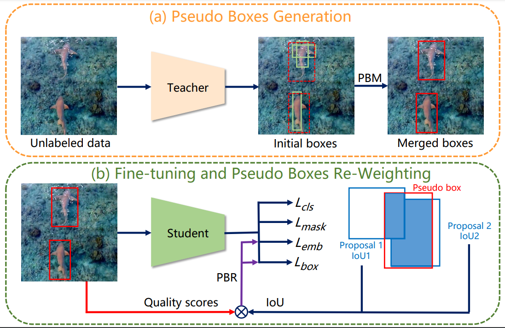
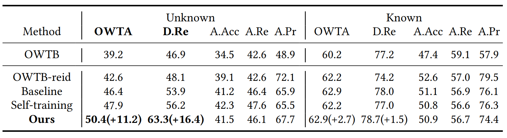

## SimOWT: A Simple Baseline for Open-World Tracking via Self-training




This repository is the project page for the paper [A Simple Baseline for Open-World Tracking via Self-training](https://dl.acm.org/doi/abs/10.1145/3581783.3611695)

## Highlight
- SimOWT is accepted to ACMMM 2023.

## Overview
We propose SimOWT, a simple baseline for Open-World Tracking(OWT). Our method demonstrates **state-of-the-art** result on the TAO-OW benchmark.

## Demo
https://github-production-user-asset-6210df.s3.amazonaws.com/103307584/282296864-14858de3-a3e5-483e-bb3b-7d3d72f5c655.mp4

## Results


## Getting started
1. Installation: Please refer to [install.md](assets/install.md) for more details.
2. Data preparation: Please refer to [data.md](assets/data.md) for more details.
3. Training, testing and Model zoo: Please refer to [train&test&model_zoo.md](assets/train&test&model_zoo.md) for more details.


## Citing SimOWT
If you find SimOWT useful in your research, please consider citing:
```bibtex
@inproceedings{10.1145/3581783.3611695,
  author = {Wang, Bingyang and Li, Tanlin and Wu, Jiannan and Jiang, Yi and Lu, Huchuan and He, You},
  title = {A Simple Baseline for Open-World Tracking via Self-Training},
  booktitle = {Proceedings of the 31st ACM International Conference on Multimedia},
  year={2023}
}
```

## Acknowledgments
- Thanks [IDOL](https://github.com/wjf5203/VNext) for providing strong baseline for Multi-Object Tracking.
